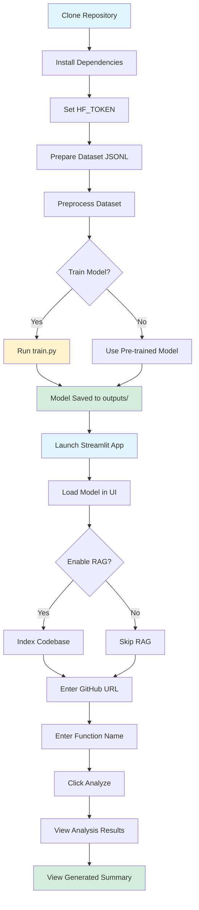

# Training and Running Guide

This is a step-by-step visual guide for training and running the Code Summarization model.

## 📚 Table of Contents

1. [Prerequisites](#prerequisites)
2. [Installation](#installation)
3. [Training the Model](#training-the-model)
4. [Running the Application](#running-the-application)
5. [Workflow Diagram](#workflow-diagram)

---

## Prerequisites

### Required
- ✅ Python 3.8 or higher
- ✅ CUDA-capable GPU (for training)
- ✅ Hugging Face account and token
- ✅ Git

### Get Hugging Face Token
1. Visit [huggingface.co](https://huggingface.co) and create an account
2. Request access to [google/gemma-2b-it](https://huggingface.co/google/gemma-2b-it)
3. Create a token at [Settings → Tokens](https://huggingface.co/settings/tokens)
4. Copy your token (you'll need it later)

---

## Installation

### Step 1: Install Dependencies

```powershell
pip install -r requirements.txt
```

**Expected packages:**
- streamlit
- tree-sitter, tree-sitter-python
- torch, transformers, peft
- datasets, evaluate
- rouge_score, bert_score
- And more...

### Step 2: Set Environment Variable

```powershell
$env:HF_TOKEN = "hf_your_token_here"
```

> **Note:** Replace `hf_your_token_here` with your actual Hugging Face token

---

## Training the Model

### Step 1: Prepare Dataset

Your dataset should be in JSONL format:

```json
{"code": "def add(a, b):\n    return a + b", "summary": "Adds two numbers", "func_name": "add"}
```

The repository includes `code_summary_dataset.jsonl` as a sample.

### Step 2: Preprocess Dataset

```powershell
python src/data/preprocess.py `
  --input_file code_summary_dataset.jsonl `
  --output_file processed_dataset.jsonl
```

**What this does:**
- ✅ Parses code using tree-sitter
- ✅ Extracts structural features (AST, CFG, PDG)
- ✅ Calculates complexity metrics
- ✅ Creates structured prompts for training

**Output:** `processed_dataset.jsonl`

### Step 3: Train the Model

```powershell
python src/model/train.py `
  --dataset_path processed_dataset.jsonl `
  --epochs 3
```

**Training Configuration:**
- Model: `google/gemma-2b-it`
- Technique: Q-LoRA (4-bit quantization)
- Batch size: 2 (with gradient accumulation)
- Learning rate: 2e-4
- Output: `outputs/` directory

**Expected Time:**
- ~2-4 hours for 3 epochs on a modern GPU (RTX 3080/4090)
- Much longer on CPU (not recommended)

**Progress Indicators:**
```
Starting training with google/gemma-2b-it...
Step 10/150 | Loss: 2.456
Step 20/150 | Loss: 1.923
...
Model saved to outputs/
```

---

## Running the Application

### Option 1: Quick Start Script (Recommended)

```powershell
.\quick_start.ps1
```

This automated script will:
1. Check Python installation
2. Install dependencies
3. Prompt for HF token
4. Preprocess dataset
5. Ask if you want to train
6. Launch the Streamlit app

### Option 2: Manual Launch

```powershell
streamlit run app.py
```

### Using the Streamlit Interface

#### 1. Load Model (Sidebar)
- **Model Name:** `google/gemma-2b-it`
- **Adapter Path:** `outputs/checkpoint-60` (or latest checkpoint)
- **HF Token:** Paste your token
- Click **"Load Model"**

#### 2. Enable RAG (Optional)
- Check **"Enable RAG"**
- Upload `code_summary_dataset.jsonl`
- Click **"Index Codebase"**

#### 3. Analyze Code
- **GitHub URL:** e.g., `https://github.com/psf/requests`
- **Function Name:** e.g., `get`
- Click **"Analyze and Summarize"**

#### 4. View Results
You'll see:
- 📄 Code preview
- 📊 Structural metrics (complexity, calls, variables)
- 🔗 CFG and PDG statistics
- 📈 Dependency graph visualization
- 🔍 Retrieved exemplars (if RAG enabled)
- ✨ Generated summary

---

## Workflow Diagram



---

## File Structure Overview

```
📁 Source Code Summarization - Gemma/
├─ 📁 src/
│  ├─ 📁 analysis/       ← AST, CFG, PDG builders
│  ├─ 📁 data/           ← preprocess.py
│  ├─ 📁 model/          ← train.py, inference.py
│  ├─ 📁 evaluation/     ← metrics.py
│  └─ 📁 utils/          ← repo_manager.py
├─ 📁 notebooks/         ← Colab notebook
├─ 📄 app.py            ← Streamlit frontend
├─ 📄 requirements.txt  ← Dependencies
├─ 📄 code_summary_dataset.jsonl ← Sample data
├─ 📄 README.md         ← Full documentation
└─ 📄 quick_start.ps1   ← Automation script
```

---

## Common Commands Cheat Sheet

| Task | Command |
|------|---------|
| Install deps | `pip install -r requirements.txt` |
| Preprocess | `python src/data/preprocess.py --input_file data.jsonl --output_file processed.jsonl` |
| Train | `python src/model/train.py --dataset_path processed.jsonl --epochs 3` |
| Run app | `streamlit run app.py` |
| Quick start | `.\quick_start.ps1` |

---

## Next Steps

After training and running:

1. **Evaluate Your Model:** Use metrics in `src/evaluation/metrics.py`
2. **Fine-tune Parameters:** Adjust LoRA config in `src/model/train.py`
3. **Add More Data:** Expand your dataset for better results
4. **Deploy:** Consider deploying with Docker or cloud services
5. **Experiment:** Try different Gemma models (7b, 9b variants)

---

## Need Help?

- 📖 See [README.md](README.md) for detailed documentation
- 🐛 Check the Troubleshooting section in README
- 💬 Review conversation history for context
- 📝 Examine `debug_treesitter.py` for parsing issues

---

**Good luck with your code summarization project! 🚀**
